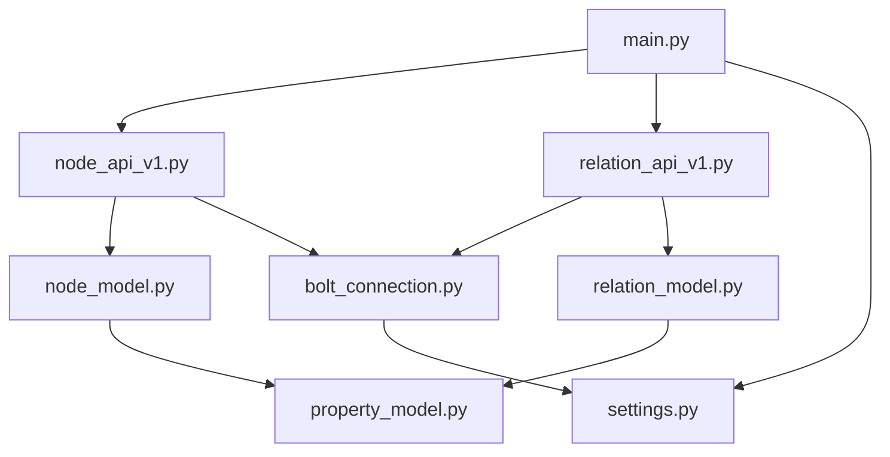

# GUI Backend

This is the backend for the GUI

**Please copy the `.env.dist` file to `.env` and set the password if necessary**

The preferred way to run this is using the docker_compose.yml one directory above. In there you
start the **backend_dev** service. This will give you access to:

- Neo4j database which you can access at http://localhost:7474/browser/
- The GUI API, which you can access at http://127.0.0.1:4999/

## Overview and files

The API server is developed using [flask](https://flask.palletsprojects.com/) (because it is well
documented and easy to understand). We use:

- [blueprints](https://flask.palletsprojects.com/en/3.0.x/tutorial/views/)
- [Flask smorest](https://flask-smorest.readthedocs.io/en/latest/)  (A nice tutorial is
  here: https://rest-apis-flask.teclado.com/docs/flask_smorest/why_flask_smorest/)
- [marshmallow](https://marshmallow.readthedocs.io/en/stable/)

Neo4j is used as a backend.




- **main.py** holds the main application code, and registers the blueprints
- **node_api.py** is the blueprint for the node related REST API
- **node_model.py** the schemata describing node related things
- **relation_api.py** is the blueprint for the relation related REST API
- **relation_model.py** the schemata describing relation related things
- **property_model.py** describes the properties that both nodes and relations can have
- **bolt_connection.py** contains all the neo4j related logic. Maybe later we want to have other connectors, like memgraph or a mock connector.
- **settings.py** reads the configuration from the env/.env


# GUI Exe

An executable can be build using pyinstaller. 

Build the frontend using `npm run build`, and copy the contents of the dist folder to the gui 
folder in the backend. Then, within the backend folder run:

`pyinstaller --onefile --add-data 'index.html:.' --add-data 'static:static' --add-data 'gui:gui' --add-data '<Full path to ...\\site-packages\\flask_smorest\\spec:flask_smorest>' -i gui/favicon.ico -n GraphEditor_0_2_alpha_1 main.py
`

When executing the .exe, the urls to access are displayed in the console window.

# Linting

We use `pylint` to verify our code. There is a `pylintrc` file in the project directory.
To run it, do following:

- Make sure the virtual environment is active.
- Make sure `pylint` is installed (available in `pip`).
- Make sure you are in `backend/`.
- Run pylint with the input `*.py` files, for example: `pylint *.py` to check
  the GUI's backend code.
- You may find the python tool `black` useful to automatically fix some linting
  problems (or not). You can simply call `black *.py` in the `backend/` directory.
  Make sure to check the resulting formatting before pushing. You can selectively
  disable  auto-formatting using the `#fmt: ...` syntax, in case applying formatting
  rules make the code less readable.

# Profiling

In order to enable profiling, you can set the variable `GUI_PROFILE_DIR`, for example:

```bash
GUI_PROFILE_DIR=".profiler" python3 main.py
```

During execution the web server generates a `.prof` file in `$GUI_PROFILE_DIR` for each
request it receives.

There are several tools to visualize profile files, for example:

```bash
pyprof2calltree -i <INPUT.prof> -o <OUTPUT>.out
kcachegrind <OUTPUT>.out
```
or https://jiffyclub.github.io/snakeviz/

```
snakeviz <INPUT.prof>
```

# Troubleshooting 

## Docker setup in wsl2

Expose the docker daemon to windows. Add `/etc/docker/daemon.json`

```json
{
  "hosts": ["tcp://0.0.0.0:2375", "unix:///var/run/docker.sock"]
}


```

Restart the docker daemon

Also make sure that the windows environment variable `DOCKER_TLS_VERIFY` is not set at all. If 
it set, even to 0 or false, it will trigger tls verification.


### Tests failing during login (using Linux in WSL)

In a freshly cloned repository it may happen that on first run using docker the
`sessions` folder is created with `root` as owner. This leads to a problem when
using testcontainers in the tests, since the application can't create and use
sessions.
To avoid that, change the rights of your local `sessions` like this:

```bash
$ chown -R $USER backend/sessions
$ chgrp -R $USER backend/sessions
```
